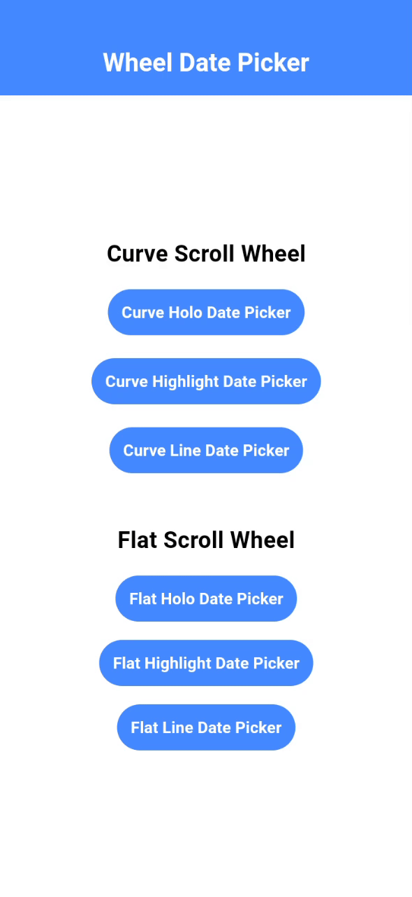
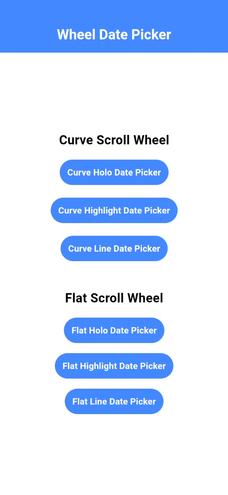
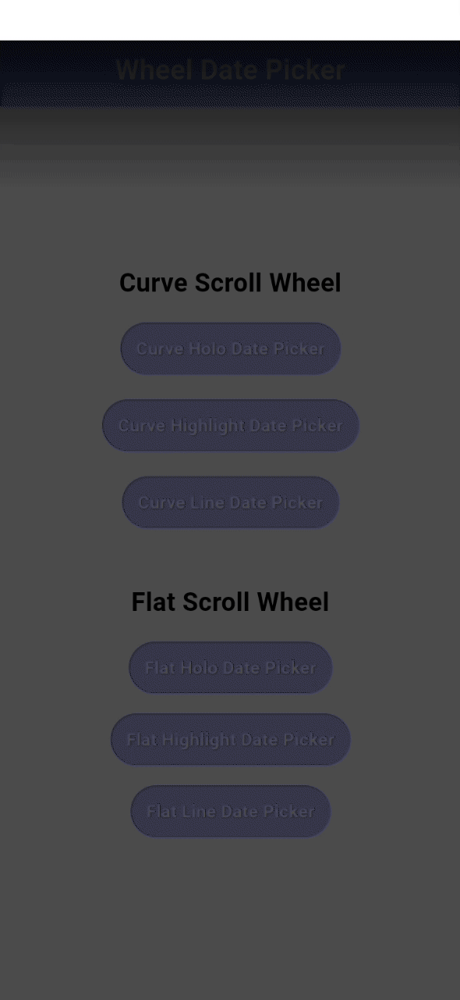
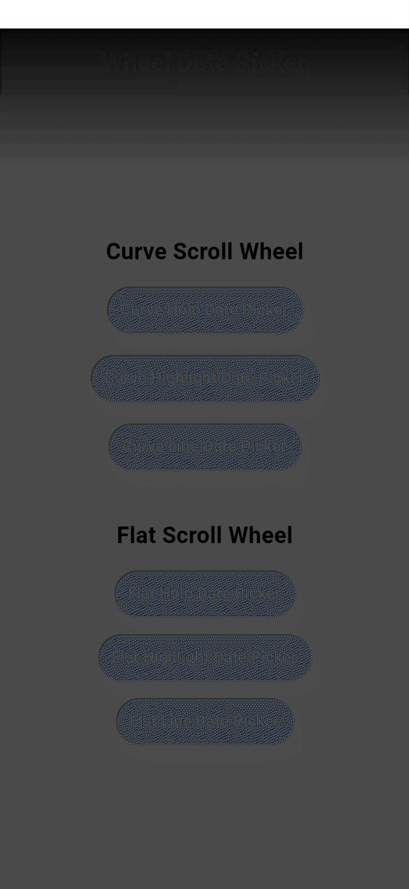
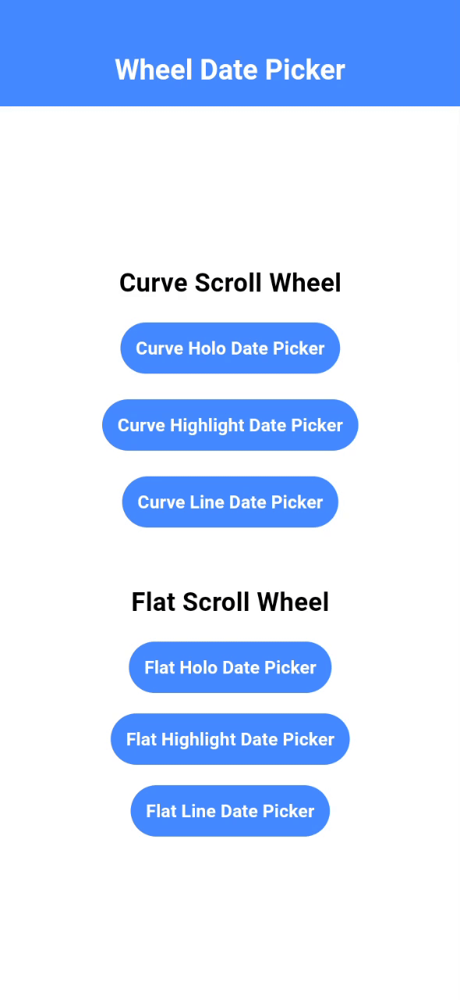
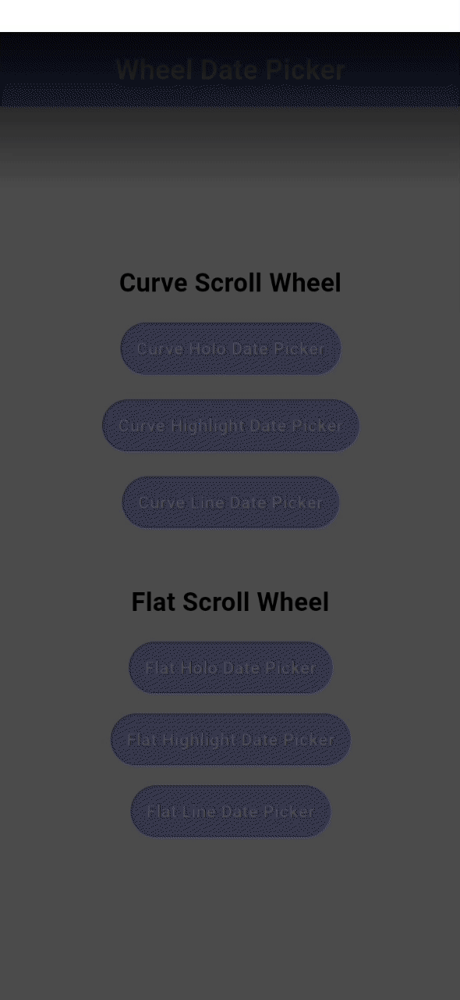

# Scroll Wheel Date Picker

Have you been in a situation where you want to use [CupertinoDatePicker](https://api.flutter.dev/flutter/cupertino/CupertinoDatePicker-class.html) but sadly you can't achieve a flat scroll view just like in android TikTok?
Or maybe, you also resorted using [ListWheelScrollView](https://api.flutter.dev/flutter/widgets/ListWheelScrollView-class.html) yet still the same?

#### Good news!

This package supports a wheel-type date-picker that has two scroll types: [CurveScrollWheel](https://github.com/Fingertips18/scroll-wheel-date-picker/blob/main/lib/src/widgets/curve_scroll_wheel.dart) and [FlatScrollWheel](https://github.com/Fingertips18/scroll-wheel-date-picker/blob/main/lib/src/widgets/flat_scroll_wheel.dart).

## Features

`WheelDatePicker` uses `ListWheelScrollView` for the `CurveScrollWheel` underneath. However, some features were added and modified in order to have the same functionality but without the curve perspective in `FlatScrollWheel`.

#### Centered Selected Item

Just like using `CupertinoDatePicker` or `ListWheelScrollView`, it allows you to select a date and expects that a particular item will always land on the center of the viewport.

#### Choose Center Overlay

You can choose what type of overlay you want to have on the current selected item. `holo`, `highlight`, and `line` are some of the overlays to choose for. If you don't want any overlays you can just set it to `none`. (Expect additional overlays or the option to add your own soon..)

#### Month Format

It allows you to select what type of month format you want to display. The available formats are `full` which simply means the complete name of the month, `threeLetters` and `twoLetters` basically formats the months based on their common abbreviations with the letter count.

#### Faded Vertical Edges

It adds fade on top and bottom to create a smooth disapearance effect when the items are beyond the viewport.

#### Listen On Item Changes After Animation Completed

Unlike `CupertinoDatePicker`, it gives you an option whether to listen to item changes only after the scroll animation ended/completed. `listenAfterChanges` defaults to true, otherwise, change to false to have the default functionality.

#### Infinite Loop

Supports looping on items. You can choose whether to enable looping on `days`, `months` or `years` individually.

## Demo

### Curve Scroll Wheel

|    Curve Holo Overlay    |    Curve Highlight Overlay    |    Curve Line Overlay    |
| :----------------------: | :---------------------------: | :----------------------: |
|  |  |  |

### Flat Scroll Wheel

|    Flat Holo Overlay    |    Flat Highlight Overlay    |    Flat Line Overlay    |
| :---------------------: | :--------------------------: | :---------------------: |
|  |  |  |

# Usage

Add the package to `pubspec.yaml`

```bash
$ flutter pub add scroll_wheel_date_picker
```

or

```yaml
dependencies:
  scroll_wheel_date_picker: ^0.0.1
```

Then import the package.

```dart
import 'package:scroll_wheel_date_picker/scroll_wheel_date_picker.dart';
```

And use like this...

```dart
ScrollWheelDatePicker(
  theme: CurveDatePickerTheme(
    wheelPickerHeight: 200.0,
    overlay: ScrollWheelDatePickerOverlay.holo,
    itemTextStyle: defaultItemTextStyle.copyWith(color: Colors.black),
    overlayColor: Colors.black,
    overAndUnderCenterOpacity: 0.2,
  ),
)
```

## Contributors

<a href="https://github.com/Fingertips18/scroll-wheel-date-picker/graphs/contributors">
  
</a>

---

_Ghian Tan_ @ _Fingertips_ ([Github](https://github.com/Fingertips18))
